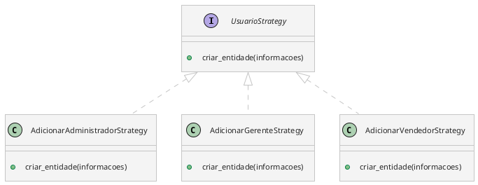
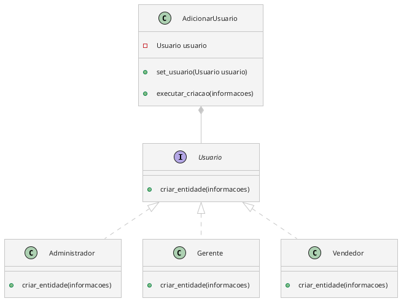

# Único Controller

Como podemos alcançar isso?

Na situação presente, existem muitos controllers. Por exemplo: `AdicionarAdministradorController`, `AdicionarGerenteController`, `AdicionarVendedorController` e `AdicionarUsuarioController`.

Podemos unir todos esses controllers para um único controller `UsuarioController`. Que ficará responsável por realizar um CRUD.

Essa não é a solução final, pois, vamos acabar unificando outros controllers, e, depois, unir todos em um único controller geral.

## Adicionar Usuário

Temos 3 tipos de usuário no sistema: Administrador, Gerente e Vendedor.

Apresentando, inicialmente, o diagrama de classes:

Vamos usar o padrão **Strategy**. A desvantagem disso é que vamos precisar mudar, ativamente, a estratégia caso seja necessário adicionar usuário de outro tipo.

Admito que essa não é a melhor maneira de fazer isso. **PENSAR EM OUTRA**.

Na minha cabeça, seria algo assim: 
- View adicionar administrador -> setar estratégia para administrador
- Método adicionar_usuario, que receberá como argumento as informações.
- A estratégia lidará em como vai adicionar.
- View adicionar vendedor -> setar estratégia para vendedor
- ...

Talvez um método adicionar_administrador? Um método para cada tipo de usuário. Sempre que chamar o método, ele muda a estratégia. Problema: pode mudar desnecessariamente.

## Adicionar Usuário

### Interface

Não faz sentido do jeito que foi feito. Nas classes que herdam de `AdicionarUsuarioController` acaba sobrescrevendo todos os métodos. **Usar interface**.

Utilizar **Strategy**.

1. Classe contexto: `AdicionarUsuario`. 
2. Classes estratégias: `Usuario` (interface), `Administrador`, `Gerente` e `Vendedor`.
3. Método de `Usuario`: `criar_entidade`, recebendo como argumento as informações coletadas pelo terminal sobre o usuário.

**Para pensar**: É, realmente, necessário instanciar um novo objeto de `adicionar_adm_controller` sempre que chama a função `adicionar_adm_constructor`?

O objeto será o mesmo, assim, podemos utilizar do padrão **Singleton**. Um único objeto no programa inteiro responsável por adicionar usuários.

Qual o raciocínio para isso?

- 