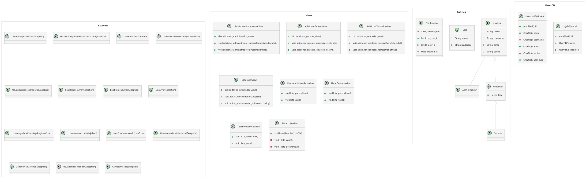
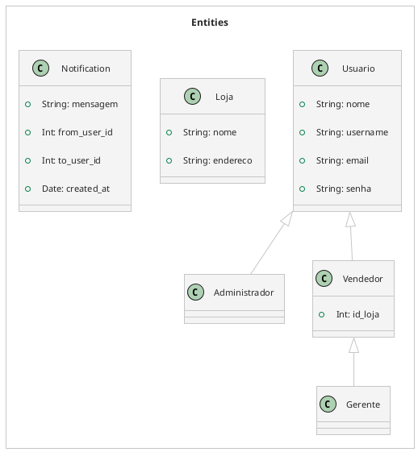
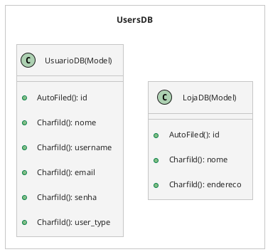
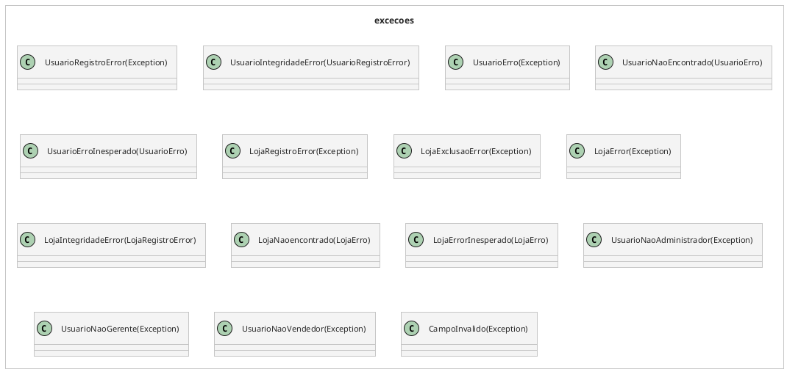
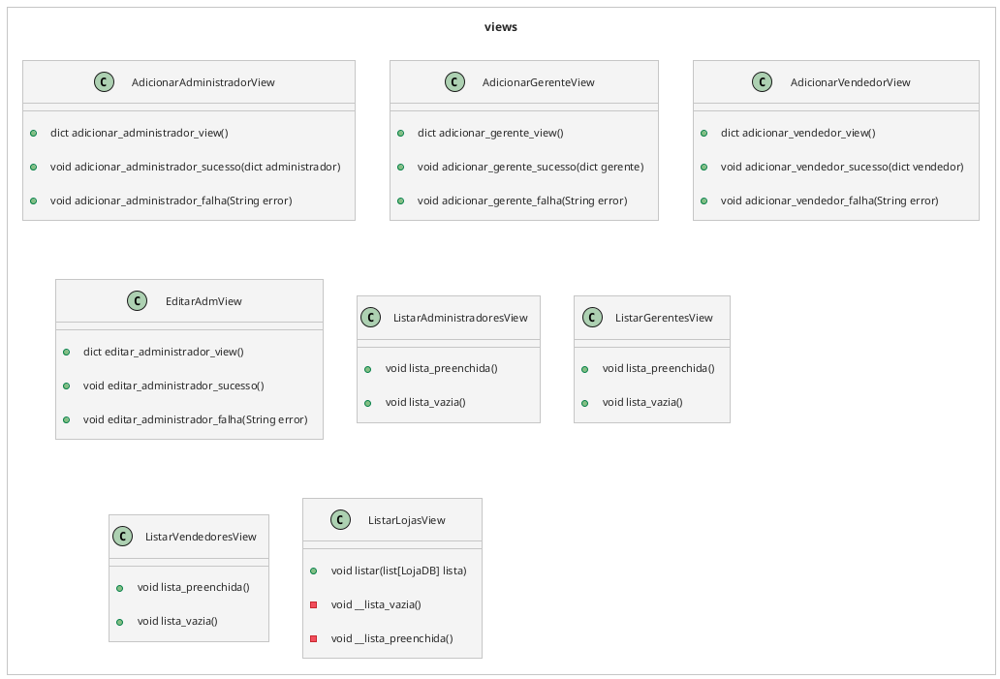
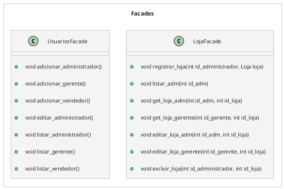

```plantuml

@startuml
!theme carbon-gray
package Entities << rectangle >> {
	class Usuario {
	+ String: nome
	+ String: username
	+ String: email
	+ String: senha
	}
	
	class Administrador
	class Gerente
	class Vendedor{
	+ Int: id_loja
	}
	
	class Loja{
	+ String: nome
	+ String: endereco
	}
	
	class Notification{
	+ String: mensagem
	+ Int: from_user_id
	+ Int: to_user_id
	+ Date: created_at
	}
	
	Usuario <|-- Administrador
	Usuario <|-- Vendedor
	Vendedor <|-- Gerente
}
  
package UsersDB << rectangle >> {
	class LojaDB(Model){
	+ AutoFiled(): id
	+ Charfild(): nome
	+ Charfild(): endereco
	}
	  
	class UsuarioDB(Model){
	+ AutoFiled(): id
	+ Charfild(): nome
	+ Charfild(): username
	+ Charfild(): email
	+ Charfild(): senha
	+ Charfild(): user_type
	}
}

package excecoes << rectangle >> {
	class UsuarioRegistroError(Exception)
	class UsuarioIntegridadeError(UsuarioRegistroError)
	class UsuarioErro(Exception)
	class UsuarioNaoEncontrado(UsuarioErro)
	class UsuarioErroInesperado(UsuarioErro)
	class LojaRegistroError(Exception)
	class LojaExclusaoError(Exception)
	class LojaError(Exception)
	class LojaIntegridadeError(LojaRegistroError)
	class LojaNaoencontrado(LojaErro)
	class LojaErrorInesperado(LojaErro)
	class UsuarioNaoAdministrador(Exception)
	class UsuarioNaoGerente(Exception)
	class UsuarioNaoVendedor(Exception)
	class CampoInvalido(Exception)
}

package views << rectangle >> {

	class AdicionarAdministradorView {
	  + dict adicionar_administrador_view() 
	  + void adicionar_administrador_sucesso(administrador: dict)
	  + void adicionar_administrador_falha(error: String)
	}

	class AdicionarGerenteView {
	  + dict adicionar_gerente_view() 
	  + void adicionar_gerente_sucesso(gerente: dict)
	  + void adicionar_gerente_falha(error: String)
	}

	class AdicionarVendedorView {
	  + dict adicionar_vendedor_view() 
	  + void adicionar_vendedor_sucesso(vendedor: dict)
	  + void adicionar_vendedor_falha(error: String)
	}

	class EditarAdmView {
	  + dict editar_administrador_view()
	  + void editar_administrador_sucesso()
	  + void editar_administrador_falha(error: String)
	}

	class ListarAdministradoresView {
	  + void lista_preenchida()
	  + void lista_vazia()
	}

	class ListarGerentesView {
	  + void lista_preenchida()
	  + void lista_vazia()
	}

	class ListarVendedoresView {
	  + void lista_preenchida()
	  + void lista_vazia()
	}

	class ListarLojasView {
	  + void listar(lista: list[LojaDB])
	  - void __lista_vazia()
	  - void __lista_preenchida() 
	}
}

@enduml
```

```plantuml

@startuml
!theme carbon-gray
package Entities << rectangle >> {
	class Usuario {
	+ String: nome
	+ String: username
	+ String: email
	+ String: senha
	}
	
	class Administrador
	class Gerente
	class Vendedor{
	+ Int: id_loja
	}
	
	class Loja{
	+ String: nome
	+ String: endereco
	}
	
	class Notification{
	+ String: mensagem
	+ Int: from_user_id
	+ Int: to_user_id
	+ Date: created_at
	}
	
	Usuario <|-- Administrador
	Usuario <|-- Vendedor
	Vendedor <|-- Gerente
}
```

```plantuml

@startuml
!theme carbon-gray

package UsersDB << rectangle >> {
	class LojaDB(Model){
	+ AutoFiled(): id
	+ Charfild(): nome
	+ Charfild(): endereco
	}
	  
	class UsuarioDB(Model){
	+ AutoFiled(): id
	+ Charfild(): nome
	+ Charfild(): username
	+ Charfild(): email
	+ Charfild(): senha
	+ Charfild(): user_type
	}
}

@enduml

```

```plantuml

@startuml
!theme carbon-gray

package excecoes << rectangle >> {
	class UsuarioRegistroError(Exception)
	class UsuarioIntegridadeError(UsuarioRegistroError)
	class UsuarioErro(Exception)
	class UsuarioNaoEncontrado(UsuarioErro)
	class UsuarioErroInesperado(UsuarioErro)
	class LojaRegistroError(Exception)
	class LojaExclusaoError(Exception)
	class LojaError(Exception)
	class LojaIntegridadeError(LojaRegistroError)
	class LojaNaoencontrado(LojaErro)
	class LojaErrorInesperado(LojaErro)
	class UsuarioNaoAdministrador(Exception)
	class UsuarioNaoGerente(Exception)
	class UsuarioNaoVendedor(Exception)
	class CampoInvalido(Exception)
}

@enduml

```

```plantuml

@startuml
!theme carbon-gray

package views << rectangle >> {

	class AdicionarAdministradorView {
	  + dict adicionar_administrador_view() 
	  + void adicionar_administrador_sucesso(dict administrador)
	  + void adicionar_administrador_falha(String error)
	}

	class AdicionarGerenteView {
	  + dict adicionar_gerente_view() 
	  + void adicionar_gerente_sucesso(dict gerente)
	  + void adicionar_gerente_falha(String error)
	}

	class AdicionarVendedorView {
	  + dict adicionar_vendedor_view() 
	  + void adicionar_vendedor_sucesso(dict vendedor)
	  + void adicionar_vendedor_falha(String error)
	}

	class EditarAdmView {
	  + dict editar_administrador_view()
	  + void editar_administrador_sucesso()
	  + void editar_administrador_falha(String error)
	}

	class ListarAdministradoresView {
	  + void lista_preenchida()
	  + void lista_vazia()
	}

	class ListarGerentesView {
	  + void lista_preenchida()
	  + void lista_vazia()
	}

	class ListarVendedoresView {
	  + void lista_preenchida()
	  + void lista_vazia()
	}

	class ListarLojasView {
	  + void listar(list[LojaDB] lista)
	  - void __lista_vazia()
	  - void __lista_preenchida() 
	}
}

@enduml

```

```plantuml

@startuml
!theme carbon-gray

package Facades << rectangle >> {
	class LojaFacade {
	  + void registrar_loja(int id_administrador, Loja loja)
	  + void listar_adm(int id_adm)
	  + void get_loja_adm(int id_adm, int id_loja)
	  + void get_loja_gerente(int id_gerente, int id_loja)
	  + void editar_loja_adm(int id_adm, int id_loja)
	  + void editar_loja_gerente(int id_gerente, int id_loja)
	  + void excluir_loja(int id_administrador, int id_loja)
	}

	class UsuariosFacade {
	  + void adicionar_administrador()
	  + void adicionar_gerente()
	  + void adicionar_vendedor()
	  + void editar_administrador()
	  + void listar_administrador()
	  + void listar_gerente()
	  + void listar_vendedor()
	}
}

@enduml

```
