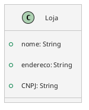

## Atributos

- Nome
- Endereço
- CNPJ



```Python
class Loja:
	def __init__(self, nome: str, endereco: str, cnpj: str):
		self.nome: str = nome
		self.endereco: str = endereco
		self.cnpf: str = cnpj
```

O `ID` é definido na hora de inserir na persistência.
