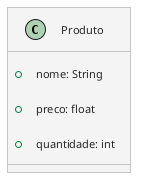

## Atributos

- Nome
- Preço
- Quantidade

```Python
class Produto:
	def __init__(self, nome: str, preco: float, quantidade: int):
		self.nome: str = nome
		self.preco: float = preco
		self.quantidade: int = quantidade
```


