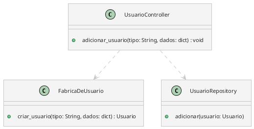
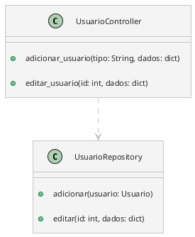
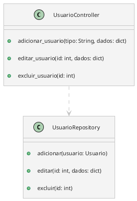
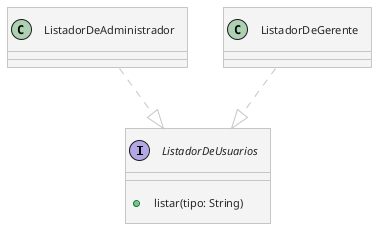

Vamos construir o raciocínio.

Considerações:
- Assumir que todas as informações recebidas como argumentos foram validadas.

## Adicionar usuário

Para adicionar um usuário no sistema, precisamos:

1. Criar o objeto correspondente ao tipo do usuário
2. Armazenar ele no banco de dados

### UsuarioFactory

A classe `UsuarioFactory` implementa o padrão de projeto **Factory Method**. Sua principal função é fornecer uma maneira centralizada e simplificada de instanciar diferentes criadores de usuários com base no tipo de usuário solicitado.

```Python
class FabricaDeUsuario {
    # Método responsável por retornar o criador adequado com base no tipo fornecido
    + criar_usuario(tipo: String, dados: dict) -> Usuario:
        if tipo == "administrador":
            return new Administrador(dados)
        elif tipo == "vendedor":
            return new Vendedor(dados)
        elif tipo == "gerente":
            return new Gerente(dados)
        else:
            raise Exception("Tipo de usuário inválido")
}
```

### Método adicionar_usuario



A classe `UsuarioController` utiliza uma estratégia (fornecida pela fábrica `CriadorDeUsuarioFactory`) para definir qual método será usado para criar o usuário, com base no tipo fornecido.

```Python
# Controller para gerenciamento de usuários
class UsuarioController:
	def adicionar_usuario(tipo: str, dados: dict):
		usuario = UsuarioFactory.criar_usuario(tipo)
		# Salvar usuário em um repositório
		UsuarioRepository.adicionar(usuario)
```

Como a classe `UsuarioRepository` funciona não entra no escopo de agora.

## Editar usuário

Para editar um usuário, é necessário saber qual o usuário (id) que será editado e as novas informações.

### Método editar_usuario



## Excluir usuário

Para excluir um usuário, é necessário saber qual o usuário (id) que será excluir.

### Método excluir_usuario



## Listagem

As classes derivadas de `ListadorDeUsuarios` poderão mostrar coisas específicas para cada tipo de usuário.



O método `listar` para `ListadorDeAdministrador` poderá:
- Listar todos os `administradores`.
- Listar todos os `gerentes`.
- Listar todos os `vendedores` cadastrados no sistema.
- Listar todos os `vendedores` de uma loja.
- Listar todos os usuários.

O método `listar` para `ListadorDeGerente` poderá:
- Listar todos os `gerentes` da loja a qual o `Gerente` que está usando no momento.
- Listar todos os `vendedores` da loja a qual o `Gerente` que está usando no momento.
- Listar todos os usuários associados a aquela loja.
