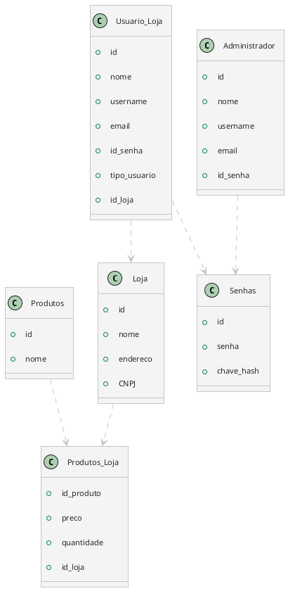

O software deve permitir duas formas para armazenar os objetos:

1. Memória RAM
2. Banco de Dados ou Arquivo Binário

**Deve ser possível alternar entre as duas formas em tempo de compilação.**

## Dúvidas

- Ao executar o software, ele transforma as informações salvas em instâncias de objetos sob demanda, considerando que é Banco de Dados ou Arquivo Binário?

## Planejamento

### Memória RAM

#### Usuários

- Um hash map para administradores e outro para os demais usuários

```Python
repositorio_adm: dict = {'Username1': adm_1, 'Username2': adm_2}
repositorio_usuarios: dict = {'CNPJ1': {'Username1': Gerente1, 'Username2': Gerente2}, 
							  'CNPJ2': {'Username3': Gerente3, 'Username4': Vendedor4}}
```
#### Lojas

- Um hash map associando o `id` ao Objeto `Loja`.

```Python
repositorio_lojas: dict = {'CNPJ1': Loja1, 'CNPJ2': Loja2}
```
#### Produtos

- Um hash map associando um `id` de uma `Loja` a um hash map dos produtos.

```Python
repositorio_produtos: dict = {'CNPJ1': {'Nome1': Produto1, 'Nome2': Produto2}, 
							  'CNPJ2': {'Nome3': Produto3, 'Nome4': Produto4}}
```

### Banco de Dados

#### Tabela Loja

- ID (chave primária)
- Nome
- Endereço
- CNPJ (chave secundária/candidata)
#### Tabelão Produtos - Loja

- ID (chave primária)
- Nome
- Preço
- Quantidade
- ID_loja
#### Tabela Administrador

- ID (chave primária)
- Nome
- Username (chave secundária/candidata)
- Email (chave secundária/candidata)
- ID_senha (chave estrangeira)
#### Tabelão Usuário - Loja

- ID (chave primária)
- Nome
- Username (chave secundária/candidata)
- Email (chave secundária/candidata)
- ID_senha (chave estrangeira)
- Tipo (Gerente ou Vendedor)
- ID_loja
#### Tabela Senhas (teórica)

- ID (chave_primaria)
- Senha (criptografada)
- Chave hash




