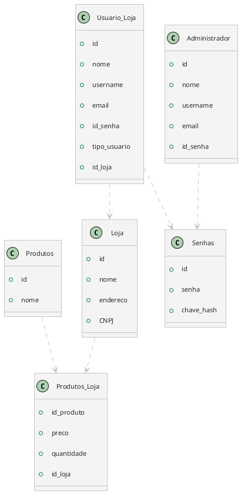

O software deve permitir duas formas para armazenar os objetos:

1. Memória RAM
2. Banco de Dados ou Arquivo Binário

**Deve ser possível alternar entre as duas formas em tempo de compilação.**

## Dúvidas

- Ao executar o software, ele transforma as informações salvas em instâncias de objetos sob demanda, considerando que é Banco de Dados ou Arquivo Binário?

## Planejamento

### Memória RAM

#### ID

Podemos utilizar um dicionário (hash map) mapeando o `identificador` do Objeto ao próprio objeto.

O `id` de um Objeto representa apenas a quantidade de elementos presentes do dicionário incrementado de 1.
#### Separação dos objetos

É preciso lembrar que todos os objetos (usuários, lojas, produtos) estarão na RAM. **Como podemos separar eles de maneira eficiente?**

- Um dicionário para cada grupo de objetos (usuários, lojas, produtos)? 

```Python
repositorio_usuarios: dict = {'ID_1': usuario_1, 'ID_2': usuario_2}
repositorio_lojas: dict = {'ID_1': loja_1, 'ID_2': loja_2}
repositorio_produtos: dict = {'ID_1': produto_1, 'ID_2': produto_2}
```

- Um dicionário único para todos os objetos? 

```Python
repositorio: dict = { 'Usuarios': {'ID_1': usuario_1, 'ID_2': usuario_2},
					  'Lojas': {'ID_1': loja_1, 'ID_2': loja_2},
					  'Produtos': {'ID_1': produto_1, 'ID_2': produto_2} }
```

- Um dicionário para os administradores e um para as lojas?

```Python
repositorio_adm: dict = {'ID_1': adm_1, 'ID_2': adm_2}
repositorio_lojas: dict = {'ID_1': loja_1, 'ID_2': loja_2}
```

Seria interessante que os objetos do tipo `Loja` tenham noção de quais são os usuários e produtos associados a eles.

```Python
repositorio_usuarios: dict = {'ID_1': usuario_1, 'ID_2': usuario_2}
repositorio_lojas: dict = {'ID_1': loja_1, 'ID_2': loja_2}
repositorio_adm: dict = {'ID_1': adm_1, 'ID_2': adm_2}
```

### Banco de Dados

#### Tabela Loja

- ID (chave primária)
- Nome
- Endereço
- CNPJ (chave secundária/candidata)
#### Tabela Produtos

- ID (chave primária)
- Nome
#### Tabelão Produtos - Loja

- ID_produto (chave estrangeira / chave primária composta)
- Preço
- Quantidade
- ID_loja (chave primária composta)
#### Tabela Administrador

- ID (chave primária)
- Nome
- Username (chave secundária/candidata)
- Email (chave secundária/candidata)
- ID_senha (chave estrangeira)
#### Tabelão Usuário - Loja

- ID (chave primária)
- Nome
- Username (chave secundária/candidata)
- Email (chave secundária/candidata)
- ID_senha (chave estrangeira)
- Tipo (Gerente ou Vendedor)
- ID_loja
#### Tabela Senhas (teórica)

- ID (chave_primaria)
- Senha (criptografada)
- Chave hash




