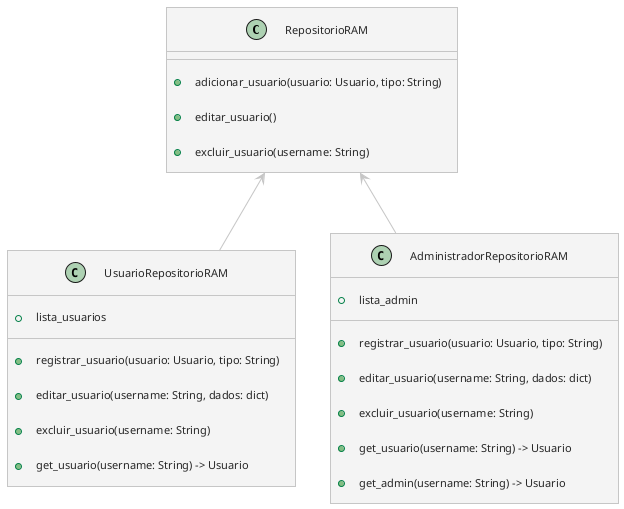

### Memória RAM

- Um hash map para administradores e outro para os outros?

```Python
repositorio_adm: dict = {'Username1': adm_1, 'Username2': adm_2}
repositorio_usuarios_loja: dict = {
								   'CNPJ1': {'Username1': Gerente1, 'Username2': Gerente2}, 
								   'CNPJ2': {'Username3': Gerente3, 'Username4': Vendedor4}}
repositorio_usuarios: dict = {'Username1': vend_1, 'Username2': ger_1}
```

`repositorio_usuarios_loja`: Um dicionário para pegar todos os usuários relacionados a uma loja.

`repositorio_usuarios`: Um dicionário que irá conter todos os usuários (`Gerente` e `Vendedor`), que será usado para verificar se um novo usuário tem um `username` já existente.

```Python
class UsuarioRepositorioRAM:
    _instance = None

    def __new__(cls):
        if cls._instance is None:
            cls._instance = super(UsuarioRepositorioRAM, cls).__new__(cls)
        return cls._instance

    def __init__(self):
        if not hasattr(self, 'repositorio_usuarios'):
            self.repositorio_usuarios: dict = {}

    def registrar_usuario(self, usuario: Usuario):
        self.repositorio_usuarios[usuario.username] = usuario

    def editar_usuario(self, username: str, dados: dict):
        objeto: Usuario = self.get_objeto(username)
        # Username não poderá ser trocado
        if 'nome' in dados:
            objeto.nome = dados['nome']
        if 'email' in dados:
            objeto.email = dados['email']
        if 'senha' in dados:
            objeto.senha = dados['senha']
        if 'id_loja' in dados:
            objeto.id_loja = dados['id_loja']

    def excluir_usuario(self, username: str):
        self.repositorio_usuarios.pop(username)

    def get_usuario(self, username: str) -> Usuario | None:
        return self.repositorio_usuarios.get(username)

    def get_usuarios(self) -> dict:
        return self.repositorio_usuarios

```

Na hora de criar o dicionário `dados`, apenas se for `Administrador` poderá colocar o campo `id_loja`.

```Python
class AdministradorRepositorioRAM:
    _instance = None

    def __new__(cls):
        if cls._instance is None:
            cls._instance = super(AdministradorRepositorioRAM, cls).__new__(cls)
        return cls._instance

    def __init__(self):
        if not hasattr(self, 'repositorio_adm'):
            self.repositorio_adm: dict = {}

	def adicionar_administrador(self, usuario: Usuario):
		self.repositorio_adm[usuario.username] = usuario

	def editar_administrador(self, username: str, dados: dict):
		objeto: Usuario = self.get_usuario(username)
		# Username nâo poderá ser trocado
		if 'nome' in dados:
			objeto.nome = dados['nome']
		if 'email' in dados:
			objeto.email = dados['email']
		if 'senha' in dados:
			objeto.senha = dados['senha']

	def excluir_administrador(self, username: str):
		self.repositorio_adm.pop(username)

	def get_administrador(self, username: str) -> Usuario | None:
		return self.repositorio_adm.get(username)

	def get_administradores(self) -> dict:
		return self.repositorio_adm
```

Tratar retorno do método `get_usuario` ao retornar `None`.

```Python

class RepositorioRAM:
	def adicionar_usuario(usuario: Usuario, tipo: str):

```



### Banco de Dados
