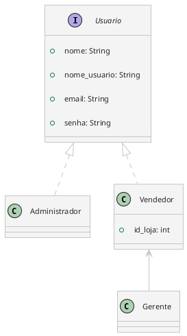

No contexto do nosso projeto, temos três usuários:

1. **Administrador**
2. **Gerente**
3. **Vendedor**

## Administrador

**Este é o usuário que tem acesso completo ao sistema.**

### Responsabilidades:

- Adicionar, editar e remover:
	- Usuários
	- Lojas
	- Produtos?
- Não realiza venda

## Gerente

**Este é o usuário que estará responsável por gerenciar uma loja**, isto é: 

1. Gerenciar vendedores
2. Gerenciar produtos

Ele também poderá realizar venda.

**No ato de criar o Gerente, devemos criar a loja também**. Uma vez que não existe loja sem gerente, nem tem como ser gerente se não tem loja.

## Vendedor

**Este é o usuário que terá como única responsabilidade a venda dos produtos** da loja a qual ele está associado.

**Ao criar o Vendedor, deve-se associar ele à uma loja existente.**

## Diagrama

Temos a interface `Usuario`, com os atributos:

- nome
- nome_usuario (username)
- email
- senha

`Administrador` e `Vendedor` herdam de `Usuario`. Para `Vendedor`, ele tem um atributo `id_loja`, o qual representa a loja que ele está associado.

`Gerente` herda da classe `Vendedor`.

