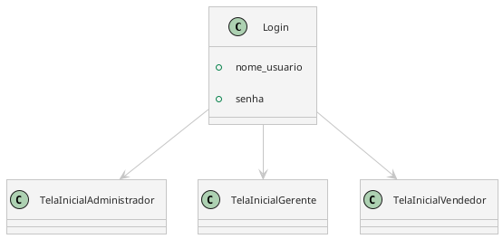
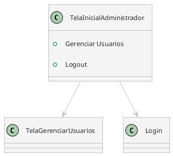
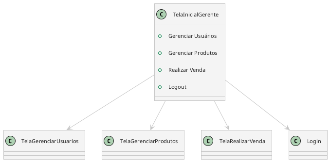
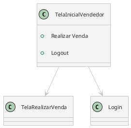
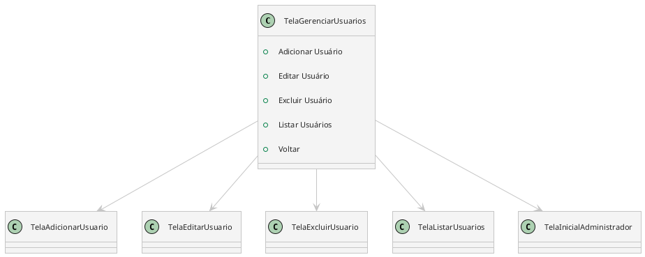
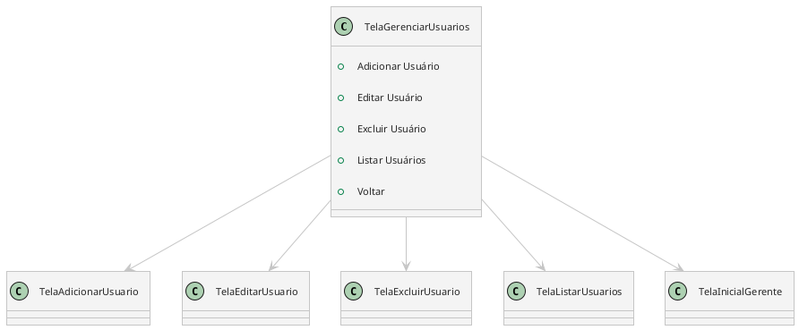
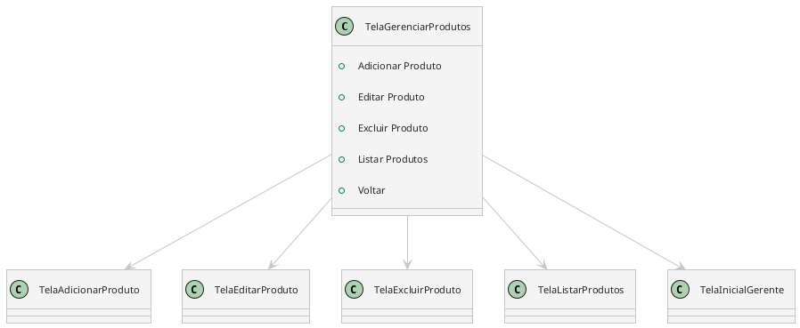
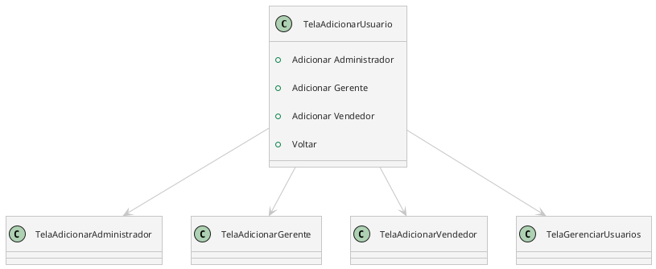
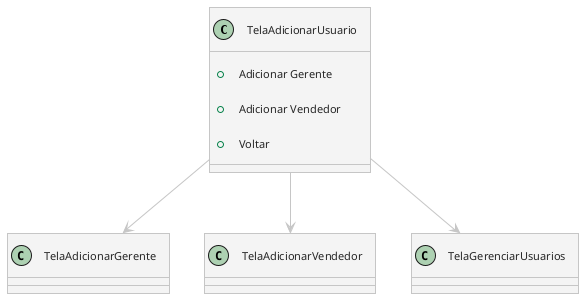

Eu vou usar UML para representar as telas. Os atributos de cada classe serão as informações mostradas.

Apenas será definido os atributos da tela atual.

## Nível 0 - Tela de Login

#### Observações

- Usar email no login?
- Nesse modelo, será necessário adicionar por fora o primeiro `Administrador` no banco de dados.

## Nível 1 - Tela Inicial de Administrador

#### Observações

- O `Administrador` poderá ter acesso as lojas?

## Nível 1 - Tela Inicial de Gerente

## Nível 1 - Tela Inicial de Vendedor

## Nível 2 - Tela de Gerenciar Usuários

### Para Administradores

### Para Gerentes

## Nível 2 - Tela de Gerenciar Produtos

### Para Gerentes

## Nível 2 - Tela de Realizar Venda

**Definir fluxo**!

1. Tem uma opção que leva para uma tela listando os produtos? Nessa tela, digitaria o ID do produto e sua quantidade.
2. Digitaria o ID do produto e sua quantidade.

## Nível 3 - Tela de Adicionar Usuário

### Para Administradores

Os `Administradores` podem adicionar qualquer tipo de usuário. 

- Para adicionar `Gerente`, é necessário criar uma loja.
- Para adicionar `Vendedor`, é necessário associar a uma loja existente.

### Para Gerentes

Os `Gerentes` podem adicionar `Gerente` e `Vendedor`.

Na hora da criação, é preciso associar os novos usuários a loja.

