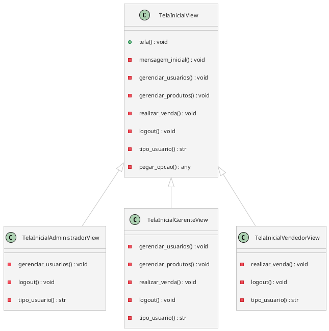

Consultar [[Fluxo.canvas|Fluxo]] para entender o que terá em cada tela.

## Uso do Template Method

Uma classe concreta com, pelo menos, um método concreto e os demais abstratos. As subclasses podem criar métodos concretos.



### Classe TelaInicialView:

```Python
class TelaInicialView:
	def tela_inicial(self):
		self.mensagem_inicial()
		self.gerenciar_usuarios()
		self.gerenciar_produtos()
		self.realizar_venda()
		self.logout()
		self.pegar_entrada()

	def mensagem_inicial(self):
		print(f'Tela Inicial de {self.tipo_usuario()}')

	@abstractmethod
	def gerenciar_usuarios(self):
		pass

	@abstractmethod
	def gerenciar_produtos(self):
		pass
	
	@abstractmethod
	def realizar_venda(self):
		pass

	@abstractmethod
	def logout(self):
		pass

	@abstractmethod
	def tipo_usuario(self):
		pass

	def pegar_opcao(self):
		return input('>> ')
```

### Classe TelaInicialAdministradorView

Para o `Administrador` só é necessário definir os métodos concretos `gerenciar_usuarios`, `logout` e `tipo_usuario`.

```Python
class TelaInicialAdministradorView(TelaInicialView):
	def gerenciar_usuarios(self):
		print('1 - Gerenciar Usuários')
		
	def logout(self):
		print('2 - Logout')

	def tipo_usuario(self) -> str:
		return 'Administrador'

```

### Classe TelaInicialGerenteView

Para o `Gerente` é necessário definir os métodos concretos `gerenciar_usuarios`, `gerenciar_produtos`, `realizar_venda`, `logout` e `tipo_usuario`.

```Python
class TelaInicialGerenteView(TelaInicialView):

	def gerenciar_usuarios(self):
		print('1 - Gerenciar Usuários')
		
	def gerenciar_produtos(self):
		print('2 - Gerenciar Produtos')
	
	def realizar_venda(self):
		print('3 - Realizar Venda ')

	def logout(self):
		print('4 - Logout')

	def tipo_usuario(self) -> str:
		return 'Gerente'
```

### Classe TelaInicialVendedorView

Para o `Vendeodr` é necessário definir os métodos concretos `realizar_venda`, `logout` e `tipo_usuario`.

```Python
class TelaInicialVendedorView(TelaInicialView):
	def realizar_venda(self):
		print('1 - Realizar Venda ')

	def logout(self):
		print('2 - Logout')

	def tipo_usuario(self) -> str:
		return 'Vendedor'
```

### Classe FabricaTelaInicialView

A ideia de fazer uma fábrica é evitar ficar usando `if`s e `else`s nos lugares errados.

```Python
class FabricaTelaInicialView:
	def criar_tela(self, tipo: str):
		if tipo == 'administrador':
			TelaInicialAdministradorView().tela_inicial()
		elif tipo == 'gerente':
			TelaInicialGerenteView().tela_inicial()
		elif tipo == 'vendedor':
			TelaInicialVendedorView().tela_inicial()
		else:
			raise Exception("Tipo de usuário inválido")
```
