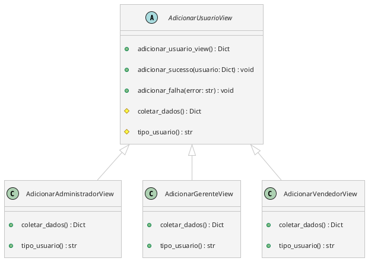

## Uso do Template Method

Podemos criar uma classe base abstrata que define o fluxo geral para adicionar qualquer tipo de usuário. As subclasses concretas (para Administrador, Gerente, etc.) irão implementar as partes específicas de coleta de dados.



^e78c64

### Explicação:

- **Classe base `AdicionarUsuarioView`**: Define o fluxo geral para adicionar usuários e contém métodos como `adicionar_usuario_view`, `adicionar_sucesso` e `adicionar_falha`. Também define dois métodos abstratos (`coletar_dados` e `tipo_usuario`) que devem ser implementados pelas subclasses.

- **Subclasses (`AdicionarAdministradorView`, `AdicionarGerenteView`, `AdicionarVendedorView`)**: Cada uma dessas subclasses implementa os métodos abstratos para coletar dados específicos e retornar o tipo de usuário.

### Pseudocódigo

```Python
Classe abstrata AdicionarUsuarioView:
    Método adicionar_usuario_view():
        Limpar a tela
        Exibir "Adicionar novo" seguido pelo tipo de usuário (fornecido pelo método tipo_usuario)
        Coletar os dados específicos do usuário (usando o método coletar_dados)
        Retornar os dados coletados como um dicionário

    Método abstrato coletar_dados():
        # As subclasses irão implementar esse método para coletar os dados específicos de cada tipo de usuário

    Método abstrato tipo_usuario():
        # As subclasses irão implementar esse método para retornar o tipo de usuário (por exemplo, "Administrador", "Gerente", etc.)

    Método adicionar_sucesso(usuario):
        Limpar a tela
        Exibir uma mensagem de sucesso contendo o nome e o email do usuário

    Método adicionar_falha(error):
        Limpar a tela
        Exibir uma mensagem de erro contendo a descrição do erro
```

```Python
Classe concreta AdicionarAdministradorView herda de AdicionarUsuarioView:
    Método coletar_dados():
        Solicitar ao usuário:
            - Nome
            - Username
            - Email
            - Senha
        Retornar um dicionário com os dados coletados

    Método tipo_usuario():
        Retornar "Administrador"

Classe concreta AdicionarGerenteView herda de AdicionarUsuarioView:
    Método coletar_dados():
        Solicitar ao usuário:
            - Nome
            - Departamento
            - Email
            - Senha
        Retornar um dicionário com os dados coletados

    Método tipo_usuario():
        Retornar "Gerente"

Classe concreta AdicionarVendedorView herda de AdicionarUsuarioView:
    Método coletar_dados():
        Solicitar ao usuário:
            - Nome
            - Loja
            - Email
            - Senha
        Retornar um dicionário com os dados coletados

    Método tipo_usuario():
        Retornar "Vendedor"
```

# Observação

- Ao criar usuário `Gerente` deve-se criar uma loja associada.
- Para adicionar um novo `Gerente` a uma loja, precisa ser feito pelo `Gerente` responsável.
